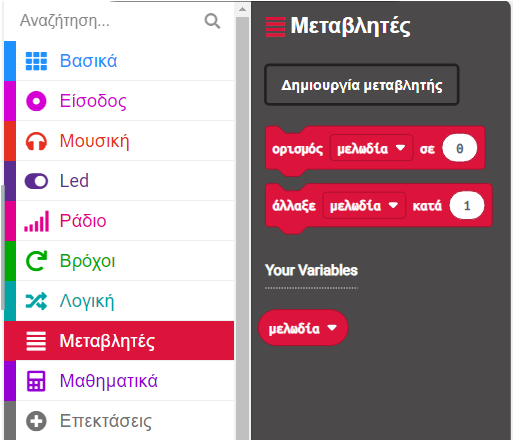

Μια μεταβλητή είναι ένας τρόπος να δώσεις όνομα και να αποθηκεύσεις δεδομένα στα προγράμματά σου. Το πρόγραμμά σου μπορεί να χρησιμοποιήσει και να αλλάξει τα δεδομένα που είναι αποθηκευμένα σε μια μεταβλητή όταν εκτελείται.

Τα δεδομένα που είναι αποθηκευμένα σε μια μεταβλητή μπορεί να είναι ένας αριθμός όπως `10` ή μια λέξη όπως `δεινόσαυρος`.

--- task ---

Άνοιξε το μενού `Μεταβλητές`{:class='microbitvariables'} και κάνε κλικ στο κουμπί **Δημιουργία μεταβλητής**.

--- /task ---

--- task ---

Ονόμασε τη νέα μεταβλητή. Σε αυτό το παράδειγμα, έχουμε ονομάσει τη μεταβλητή `μελωδία`.

Κάνε κλικ στο κουμπί Ok.

--- /task ---

Θα υπάρχουν πλέον διαθέσιμα νέα μπλοκ που μπορείς να χρησιμοποιήσεις για να ορίσεις, να αλλάξεις ή να χρησιμοποιήσεις την τιμή που είναι αποθηκευμένη στη μεταβλητή.

Μπορείς να τα σύρεις μέσα σε άλλα μπλοκ για να τα χρησιμοποιήσεις στο πρόγραμμά σου.
