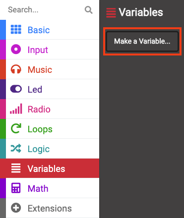
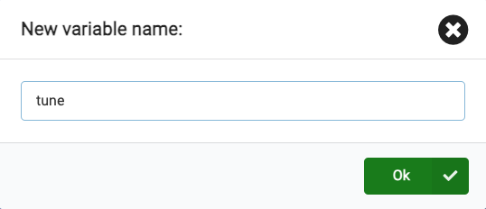
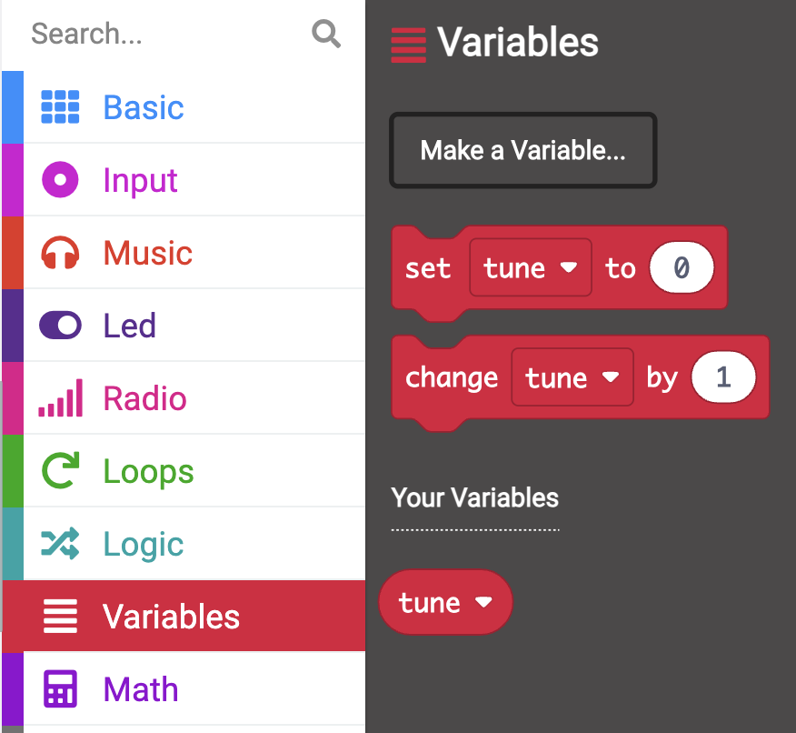

A variable is a way of labelling and storing data in your programs. Your program can use and change the data stored in a variable when it runs.

Data stored in a variable might be a number like `10` or a word like `dinosaur`.

Open the `Variables`{:class='microbitvariables'} menu, and click **Make a Variable**.

Name the new variable, in this example we have named the variable `tune`. 

Click the Ok button.

--- /task ---

There will now be new blocks available that you can use to set, change or use the value stored in the named variable. 

You can drag these inside other blocks to use within your program.
