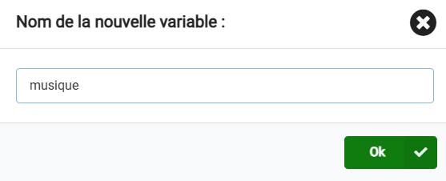
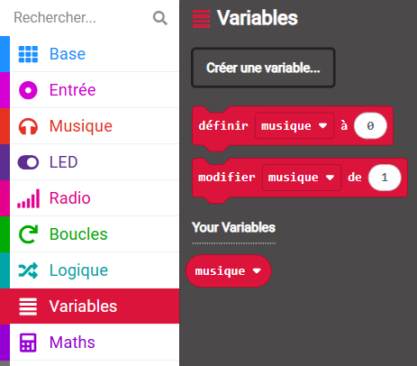

Une variable est un moyen d'étiqueter et de stocker des données dans tes programmes. Ton programme peut utiliser et modifier les données stockées dans une variable lors de son exécution.

Les données stockées dans une variable peuvent être un nombre comme `10` ou un mot comme `dinosaure`.

--- task ---

Ouvre le menu `Variables`{:class='microbitvariables'} et clique sur **Créer une variable**.

--- /task ---

--- task ---

Nomme la nouvelle variable. Dans cet exemple, nous avons nommé la variable `musique`.

Clique sur le bouton OK.

--- /task ---

De nouveaux blocs sont désormais disponibles pour définir, modifier ou utiliser la valeur stockée dans la variable nommée.

Tu peux les faire glisser dans d'autres blocs pour les utiliser dans ton programme.
