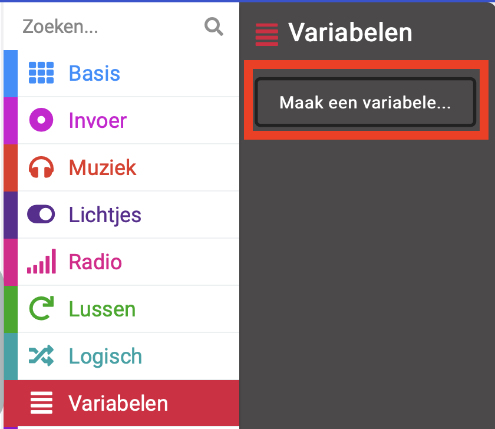
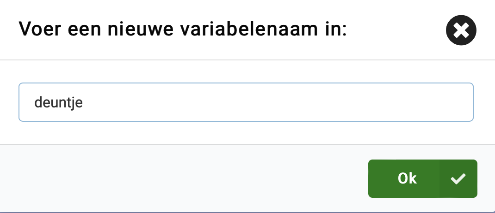
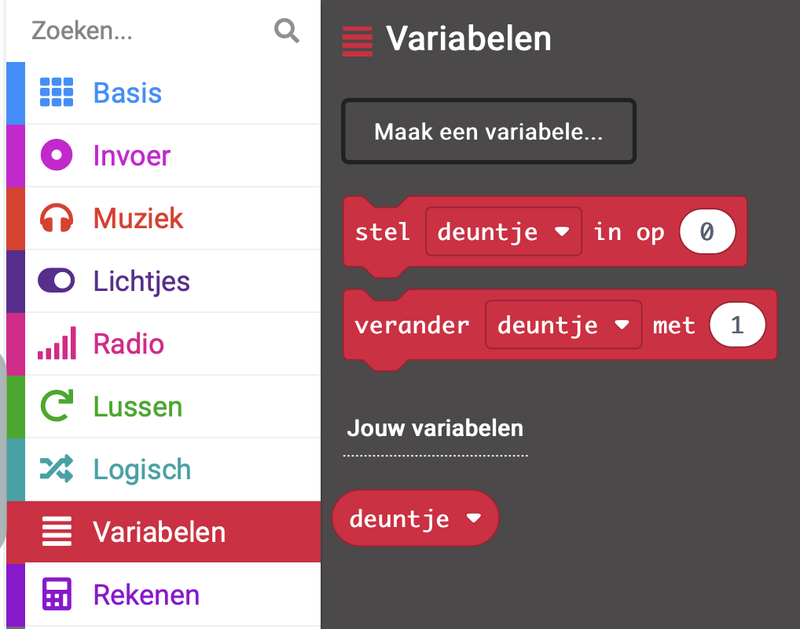

Een variabele is een manier om gegevens in je programma's te benoemen en op te slaan. Je programma kan gegevens die zijn opgeslagen in een variabele gebruiken en wijzigen wanneer het wordt uitgevoerd.

Gegevens die in een variabele zijn opgeslagen, kunnen een getal zijn zoals '10' of een woord zoals 'dinosaurus'.

--- task ---

Open het `Variabelen`{:class='microbitvariables'} menu en klik op **Maak een variabele**.

--- /task ---

--- task ---

Geef de nieuwe variabele een naam. In dit voorbeeld hebben we de variabele `deuntje` genoemd.

Klik op de Ok knop.

--- /task ---

Er zullen nu nieuwe blokken beschikbaar zijn die je kunt gebruiken om de waarde die is opgeslagen in de gemaakte variabele in te stellen, te veranderen of te gebruiken.

Je kunt deze in andere blokken slepen om te gebruiken in je programma.
